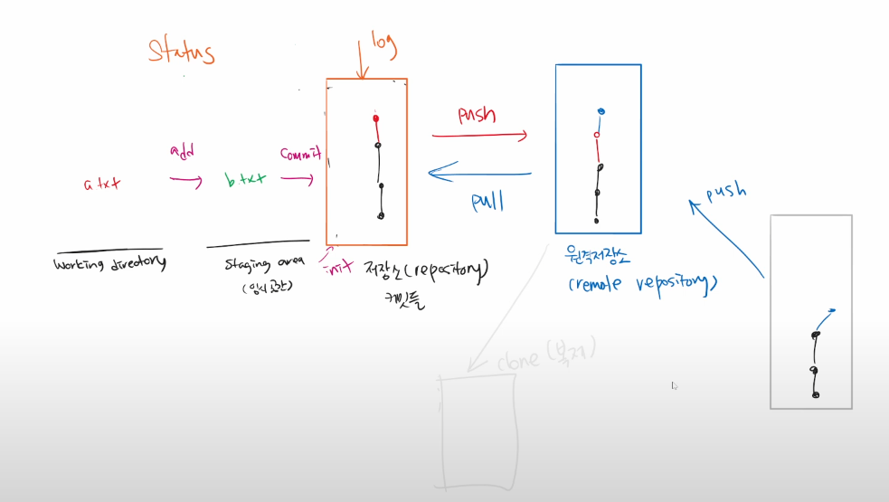
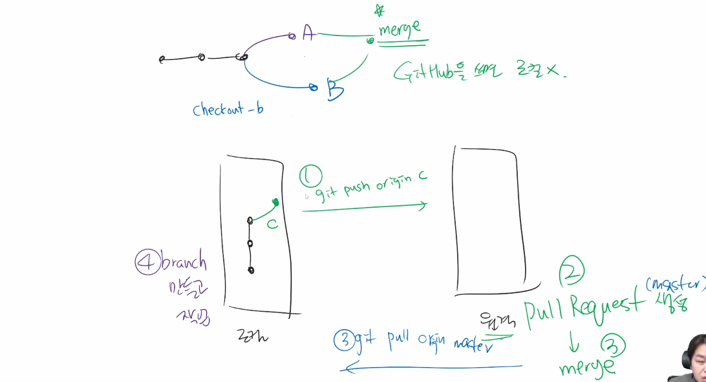

- 졸업프로젝트

1. 자료조사
2. 보고서 작성
3. 발표자료


자료조사를 하여 여러개의 텍스트 파일로 만들어 지고나서

자료를 바탕으로 보고서라는 테스트를 만들었을 경우

자료조사 텍스트와 보고서 텍스트가 있을떄 버전의 정리 시

자료조사 단계에서 커밋하여 버전을 기록 - 기록메세지 **`자료조사`**

자료조사를 보충 후 커밋으로 버전을 기록 - 기록메세지 **`보충자료`**

보고서 작성하여 커밋하여 버전을 기록 - 기록메세지 **`보고서작성`**


로그로 볼경우 

```python
git log 
	보고서작성
    보충자료
    자료조사
```


**git checkout 로그번호(앞의 6자리)**

해당 버전으로 이동한다?돌아간다?

파일이 삭제되거나 수정되어도 커밋만 되어 있으면 되돌릴 수 있음

커밋되지 않은 내용은 방법 없음!!!!!

```python
git log --oneline
9er345 보고서작성(head)
98sd76 보충자료
8fhr5f 자료조사
```

> 현재의 버전 표시 : (head)


원격저장소( github)에 푸쉬한 폴더(파일)를 삭제하고 싶을경우

로컬에서 해당 폴더(파일)를 삭제하고 다시 커밋하여 푸쉬


> **git**은 만들어진 내용에 대하여 **기록지점(*버전*)을 만드는 역할**일뿐


러버덕 디버깅? 인형과 대화하며 디버깅(오류를 찾다) 

현업에 나가서 사수나 다른 직원이 나를 보며 '이게 왜안될까?'하며 말을하는건 

묻는게 아니라 **`러버덕 디버깅`**일수있다


| git pull                     | git clone             |
| ---------------------------- | --------------------- |
| 원격저장소의 커밋만 받아온다 | 원격저장소를 받아온다 |


일반적인 개발 프로젝트 시작시

- 조장 : `git init` 저장소를 만듬(로컬)  >`push`>  `github` 원격저장소를 만듬
- 조원 : `github`원격저장소에 초대받아서 >`clone`> 로컬에 저장소를 만듬

작업하면서는 pull 과 push 하면서 진행


# 오후

##### 작업 / 협업하게 되면 브랜치(`branch`)를 활용하여 가지치기를 하게된다

가지치기란 사용자가 보는 화면인 `master` 를 만들기 위해 

각 협업자들이 다른 `브랜치`로 작업을 하여 

완료된 결과물을 각 `브랜치`를 활용하여 합치고 

사용자가 보는 `master`로 올려 화면이 보이게 하는 

진행 흐름을 말한다


## - 브랜치(branch)

- git branch
  - 브랜치 조회
- git branch example
  - example 이름으로 브랜치 생성
- git checkout example
  - 기존 브랜치에서 example 브랜치로 이동

마스터에서 커밋된 로그가 1번이고

이그잼플 브랜치를 만들어서 커밋된 로그가 2번일경우

이그잼츨에서 로그를 보면 1번,2번이 다 보이나

마스터로 브랜치 이동후 로그를보면 1번만 보임

- git merge example
  - 마스터에서 입력하여 각 브랜치의 커밋을 합친다
- git barnch -d example
  - 브랜치를 삭제함
  - 마스터에 합쳐진 이후 가지 브랜치를 삭제해도 커밋은 지워지지 않는다

---

조모임

- 인원은 2명 조장,조원

- 보고서,발표자료,제출

  업무분담법

  |      | 조장                            | 조원                           |                                                              |                |
  | ---- | ------------------------------- | ------------------------------ | ------------------------------------------------------------ | -------------- |
  | 1    | 보고서,발표자료                 |                                |  | 혼자다함       |
  | 2    | 보고서                          | 발표자료                       |  | 서로 다른파일  |
  | 3    | 보고서 파트1 <br>발표자료 파트1 | 보고서 파트2<br>발표자료 파트2 |  | 서로 같은 파일 |

​		3번 상황에 익숙하도록


# 풀 리퀘스트

- 깃헙에서 A가 B의 레포를 포크해와서 수정하여 B에게 보내서 머지를 요청하는 것


수업중 스크린샷






