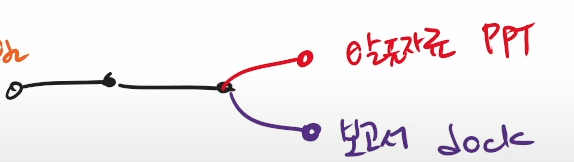
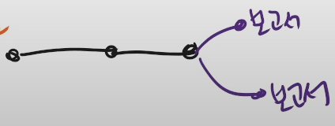

# 브랜치(branch)

- branch(가지치기)를 시작하기 위해 뿌리(root-commit)가 필요하다

> 뿌리(**root-commit**)에서 시작하여 가지(**branch**)처럼 각각 뻗어나가며
>
> 최종에는 통합(**merge**)되어 실사용 된다.

### 명령어

| 입력 코드 (현재 브랜치 : master) | 설명                                      |
| -------------------------------- | ----------------------------------------- |
| git branch                       | 브랜치 조회                               |
| git branch <\name>               | <\name>으로 브랜치 생성                   |
| git checkout <\name>             | <\name> 브랜치로 이동                     |
| git checkout -b <\name>          | <\name> 브랜치 생성 후 해당 브랜치로 이동 |
| git branch -D <\name>            | <\name> 브랜치 삭제                       |
| git merge <\name>                | master 에 <\name> 브랜치를 통합 작업      |

>  **master에 통합(merge)된 후 브랜치가 삭제 되어도 커밋은 지워지지 않는다.**

#### 예시

- 목표 : 조별과제
  - 인원 : 2명 (조장 , 조원)
  - 보고서 , 발표자료 업무 분담

|      | 조장                            | 조원                           |                                                              |                |
| ---- | ------------------------------- | ------------------------------ | ------------------------------------------------------------ | -------------- |
| 1    | 보고서,발표자료                 |                                |  | 혼자다함       |
| 2    | 보고서                          | 발표자료                       |  | 서로 다른파일  |
| 3    | 보고서 파트1  발표자료 파트1 | 보고서 파트2 발표자료 파트2 |  | 서로 같은 파일 |

> 어떠한 상황으로 작업을 하는가도 중요하며 
>
> 통합(**merge**) 시에 **master**권한자의 업무숙지 / 편집 능력이 중요함.