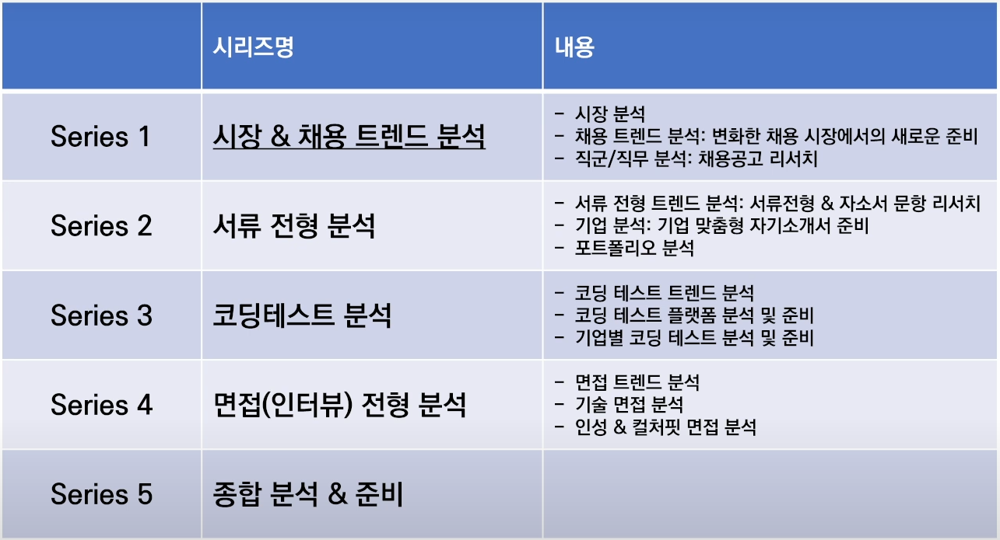
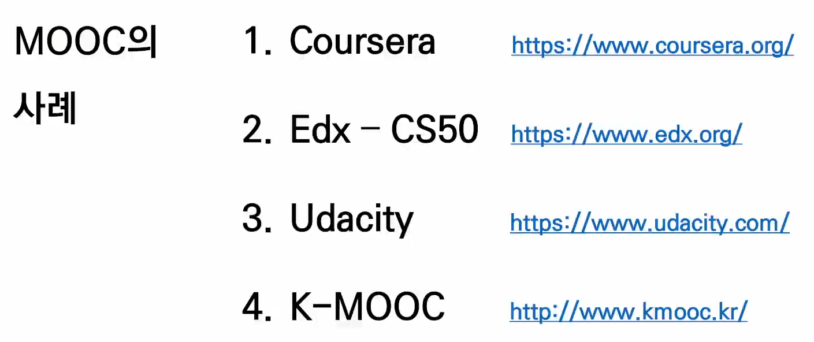
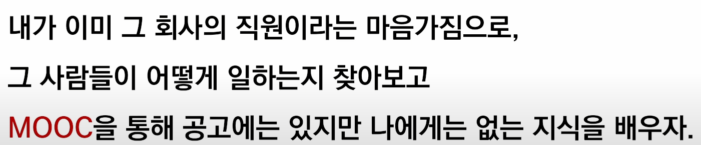
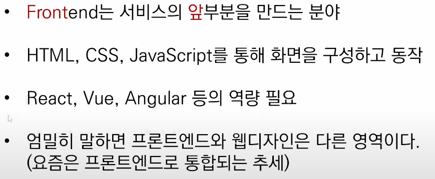
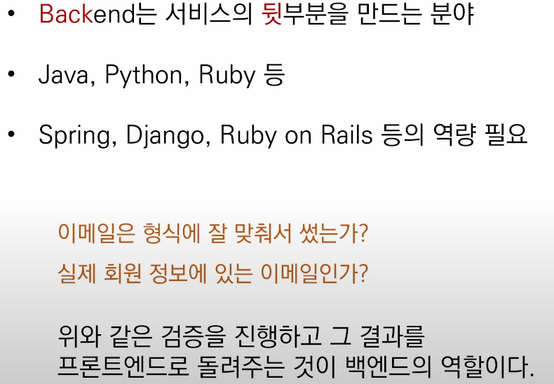
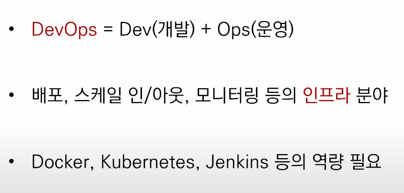
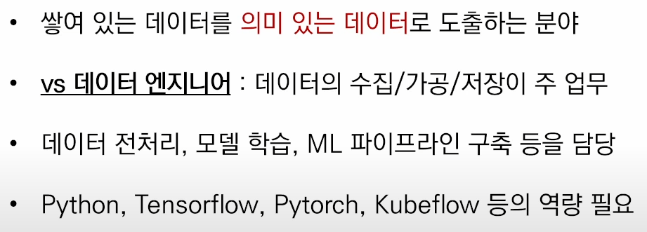

# 어제의 복습

오류 발생 상황 (기본적으로 오타 확인 필수! / 오류 메세지 확인!!)


- commit 후 오류
  - status에서 add가 되었는지 상태확인
- push 후 오류
  - commit 이 잘 되었는지 log 확인
  - guthub 에 이상이 있는지 확인
  - remote -v 에서 github 경로 설정 확인

​	

포크 앤 풀리퀘스트 하는 이유 (쉐어드 레포 : 초대받고 권한을 받아 진행)

- 소유권이 없는 상탱의 협업을 위해
  - 소유권자의 깃헙에서 포크로 가져옴
  - 본인 깃헙에서 로컬로 클론으로 로컬 저장
  - 작업 하려면 작업내용에 맞게 브랜치 명확히 생성
  - 작업 / add / commit 후 본인 깃헙으로 push
  - 본인 깃헙에서 소유권자의 깃헙으로 풀리퀘스트 요청


로컬에서는 병합은 merge인데 깃헙에서는 왜 풀리퀘스트인가?

- 깃랩에서는 머지 리퀘스트로 돼어있음

## 사용의 이유

- .gitkeep : 빈 폴더가 있는 버전을 만들기 위해서
  - git은 효율적인 관리는 위해 파일을 기본으로 하여

    빈폴더는 관리가 안 되기 때문에 해당 코드로 관리 가능하도록 사용
  
- .gitignore : 깃으로 추적하지 않는 파일의 관리
  
  - git은 모든 하위 디렉토리의 파일을 추적하기때문에
  
    add나 commit 하지 않아도 되는 파일을 git의 추적에서 벗어나게 하려고 사용
  


# 🚩오전 특강




### 4차 산업혁명

1. 사람이 하는 일자리가 줄어든다
   1. 새로운 일자리가 늘어는 시간보다 줄어드는 시간이 빠르다
2. 기술 생산과 기술 활용이 분리된다
   1. 현재는 기술 이해만 있다면 누구나 활용 가능한 시대

> 따라서 요즘은 회사네 들어가지 않아도
>
> 기술을 배우고 활용할 수 있는 시대이다


- 회사에서 경력직을 성호하는 이유는 역량 추정이 가능하기 때문이다


깃헙은 채용에 있어서 중요하다

깃헙의 정보가 나의 포트폴리오 / 성실함을 대변한다


정보처리기능사 자격증의 필요성?

필수는 아니지만 있다면 도움이 된다


### 직장 < 커리어 < 삶

- `개발자가 되고 싶다`가 아닌 `개발자다` 라는 마인드

- 기업 면접에서 기죽지말고 `나는 기업에서 모시고 갈 개발자이다` 가 되자!!


MOOC?



해당 플랫폼 마다 시청 할 수 있는 좋은 강의가 많다

- cd50 : 유투브에서도 검색하면 강의 영상 시청가능


introduction to machine learning udacity 유투부 검색하여 영상 시청

영어가 힘들다면 K-MOOC도 있다. 다행이다😢


codecademy??


<details> 
    <summary>제목</summary> 
    이런거말하는건가?</details>

<details>

<summary>오늘의 오후</summary>

# 여기에 입력하면 접으면 안 보이고<br>

1. 열면 보이는 신기한 html코드<br> 줄 넘기려면<\br>도 입력해야하네

</details>

```html
<details>
    <summary>제목</summary>
    내용입력<\br>줄넘김</\br>
    
    
</details>
<span style="color:red"> 빨강 글씨 Red Font </span>
```

<span style="color:red"> 빨강 글씨 Red Font </span>


# 🚩오후 특강


- 채용시장으 공채에서 역량 중심으로 변화한다
- 프로젝트는 깃헙


> 취업 절대 공식
>
> 1. github TIL을 2년 이상 지속
> 2. 나의 언어로 타인에게 설명할수 있는 sw역량
> 3. 유저가 실사용 하는 프로젝트를 개발 & 유지보수
>    - 10명이라도 좋으니 유저가 사용 하려하는 프로젤트를 만드는게 어렵다


지금은?

- 4차 산업혁명 시대(직무 역량중심 채용의 시대)

- 회사에 들어기 않아도 기술을 `학습` 할 수 있는 시대 
- 공채가 저물고 `직무 역량`으로 검증하는 수시 채용 시대


자소서는 기업이 읽었을 때 이 사람의 모습(과거/지식/포부/주관적성격)을 볼 수 있는 가장 기본이다





sw직군 과 분야

- 개발

프론트엔드



백엔드



- 관리

데브옵스



데이터 사이언티스트



