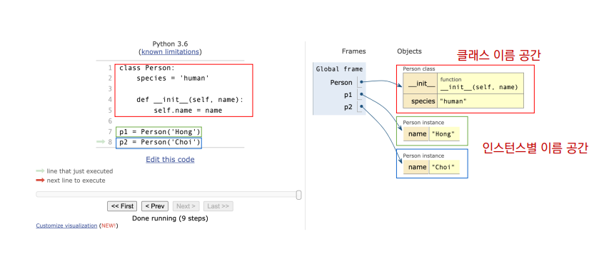

# 🚩클래스 

- 클래스 속성

  - 한 클래스의 모든 인스턴스라도 똑같은 값을 가지고 있는 속성

  - \<classname>.\<name>으로 접근 및 할당

  ```python
  class Circle:
      pi = 3.14		#클래스 변수 정의
      
  c1 = Circle()
  c2 = Circle()
  
  print(Circle.pi)		# 3.14
  print(c1.pi)			# 3.14
  print(c2.pi)			# 3.14
  ```

  

- 인스턴스와 클래스 간의 이름 공간(namespace) 

  - 클래스를 정의하면, 클래스와 해당하는 이름 공간 생성 
  - 인스턴스를 만들면, 인스턴스 객체가 생성되고 이름 공간 생성 
  - 인스턴스에서 특정 속성에 접근하면, 인스턴스-클래스 순으로 탐색

  ##### -  python-tutor 예시




- 클래스 메소드

  - 클래스가 사용할 메소드
  - @classmethod 데코레이터를 사용하여 정의
    - 데코레이터 : 함수를 어떤 함수로 꾸며서 새로운 기능을 부여
  - 호출 시,  첫번째 인자로 클래스(cls)가 전달됨

  ```python
  class MyClass
  	
      @classmethod
      def class_method(cls, arg1, ...)
  
  MyClass.class_method(...)
  ```

  

- 스태틱 메소드

  - 인스턴스 변수, 클래스 변수를 전혀 다루지 않는 메소드
  - 언제 사용하나?
    - 속성을 다루지 않고 단지 기능(행동)만을 하는 메소드를 정의할 때 
    - @staticmethod 데코레이터를 사용하여 정의
    - 호출 시 , 어떠한 인자도 전달되지 않음

  ```python
  class MyClass:
  
      @staticmethod
  	def class_method(arg1, ...)
  
  MyClass.static_method(...)
  ```

---

# 🚩객체 지향의 핵심개념

- 추상화

  - 어떠한 기능들을 동작할 수 있도록 하나의 형식을 만든다. 

- 상속 

  - 클래스간의 부모 - 자식 관계를 정립함

  - 하위 클래스는 상위 클래스에 정의된 속성, 

    행동, 관계 및 제약 조건을 모두 상속 받음

  -  super()를 통해 부모 클래스의 요소를 호출할 수 있음

  -  메소드 오버라이딩을 통해 자식 클래스에서 재정의 가능함

- 다향성

  - 동일한 메소드가 클래스에 따라 다르게 행동할 수 있음을 의미

  - 메소드 오버라이딩

    - 상속 받은 메소드를 재정의

    - 부모 클래스의 메소드 이름과 기본 기능은 그대로 사용하지만, 

      특정 기능을 바꾸고 싶을 때 사용

- 캡슐화

  - 객체의 일부 구현 내용에 대해 외부로부터의 직접적인 액세스를 차단
  - 파이썬에서 기능상으로 존재하지 않지만, 관용적으로 사용되는 표현이 있음
  - 접근제어자 종류
    - Public Access Modifier : 어디서나 호출 가능
    - Protected Access Modifier : 암묵적으로 부모와 자식 클래스에서 호출 가능
    - Private Access Modifier : 본인 클래스에서만 호출 가능

