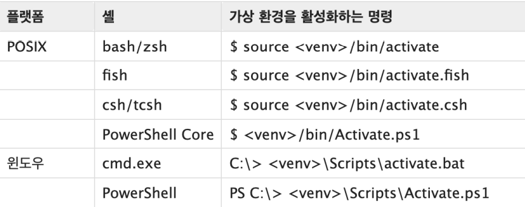

# 🚩파이선 응용/심화

### 1. List Comprehesion

- 표현식과 제어문을 통해 특정한 값을 가진 리스트를 간결하게 생성하는 방법

  ```python
  cubic_list = []
  for number in range(1, 4):
  	cubic_list.append(number**3)
  print(cubic_list)
  
  # 아래 처럼 간결화 가능
  [number**3 for number in range(1, 4)]
  # 조건식도 추가 가능
  [i for i in range(1, a+1) if a % i == 0]
  ```
  
  

### 2. Dictionary Comprehension

- 표현식과 제어문을 통해 특정한 값을 가진 딕셔너리를 간결하게 생성하는 방법

  ```python
  cubic_dict = {}
  for number in range(1, 4):
  	cubic_dict[number] = number**3
  print(cubic_dict)
  
  # 아래 처럼 간결화 가능
  {number: number**3 for number in range(1, 4)}
  # 동일하게 조건식 추가 가능
  {number: number**3 for number in range(1, 4) if number != 2}
  ```

  

### 3. lambda

- 람다함수

  - 표현식을 계산한 결과 값을 반환하는 함수로, 이름이 없는 함수여서 익명 함수라고도 불림

  - return을 가질 수없음. 간편 조건문 외 조건문, 반복문을 가질 수 없음.

  - 장점으로는 함수를 정의 하는 것 보다 간결하게 사용이 가능하고

    def 사용을 할 수 없는 곳에서도 사용이 가능하다.

### 4. filter

-  순회 가능한 데이터구조(iterable)의 모든 요소에 함수(function)적용하고, 

  그 결과가 True인 것들을 filter object로 반환

  ##### map(function), iterable) 과 동일 구조

---

> #### \* 알고 갑시다 \*
>
> ##### 파이썬 버전 업데이트에 따른 삭제되는 코드와 새로 생겨나는 코드를 확인이 필요하다
>
> ##### 버전에 따른 대응을 해야 한다.

---

## 📕 모듈 / 패키지 / 라이브러리

- 모듈 : 다양한 기능을 하나의 파일로 

- 패키지 : 다양한 파일을 하나의 폴더로 

- 라이브러리 : 다양한 패키지를 하나의 묶음으로

> 모듈 < 패키지 < 라이브러리로 생각할 수 있다

#### 1. pip (파이썬 패키지 관리자)

- 외부 패키지들을 설치하도록 도와주는 패키지 관리 시스템

- 명령어

  - pip install : 설치
  - pip list : 정보 확인
  - pip uninstall : 삭제
  - pip freeze : 목록 생성

- 패키지 관리

  - 아래 명령어들로 관리 가능(패키지 기록의 일반적 명칭 : requirements.txt )

  - pip freeze > requirements.txt 로 목록을 생성하여 

    pip install –r requirements.txt 로 목록의 패키지를 설치

---

## 📗 가상환경

> ##### 여러 프로젝트를 하는 경우 버전이 다를 수 있으며 그럴 경우 
>
> ##### 프로젝트 별로 버전 / 패키지를 다르게 사용 할 수 있도록 관리하는 것!!

#### 1. venv

- 가상 환경을 만들고 관리하는데 사용되는 모듈 (Python 버전 3.5 이후 사용)

- 특정 디렉토리에 가상 환경을 만들고, 고유한 파이썬 패키지 집합을 가질 수 있음

  1. 생성 : 해당 디렉토리에 별도의 파이썬 패키지가 설치함

      ```bash
      $ python –m venv <폴더명>
      ```

  2. 활용 

     - 활성화 명령어 목록

     

     - 비활성화 명령어

     ```bash
     $ deactivate 
     ```

     

     