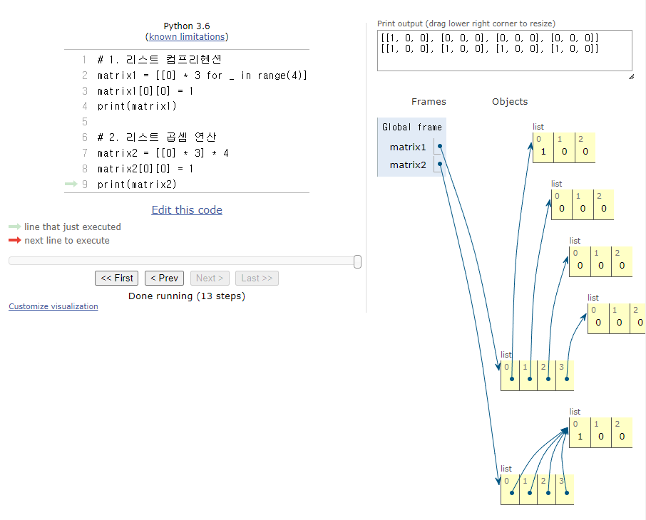

# 📕이차원 리스트

### 1. 이차원 리스트 

- 리스트를 원소로 가지는 리스트일 뿐이다.

- 이차원 리스트는 행렬(matrix)이다.

  ```python
  matrix = [[1, 2, 3],[4, 5, 6],[7, 8, 9]]
  # 보기좋게 변경하면 행렬의 형태로 나옴
  matrix = [
      [1, 2, 3],	#0행
      [4, 5, 6],	#1행
      [7, 8, 9]	#2행
  ] # 0열 1열 2열
  ```

- !!!! 주의 !!!!

  -  리스트 컴프리헨션 vs 리스트 곱셈 연산의 차이점

  ```python
  n = 4 # 행
  m = 3 # 열
  
  matrix1 = [[0] * m for _ in range(n)]
  matrix2 = [[0] * m] * n
  
  print(matrix1)
  # [[0, 0, 0], [0, 0, 0], [0, 0, 0], [0, 0, 0]]
  print(matrix2)
  # [[0, 0, 0], [0, 0, 0], [0, 0, 0], [0, 0, 0]]
  
  matrix1[0][0] = 1
  matrix2[0][0] = 1
  
  print(matrix1)
  # [[1, 0, 0], [0, 0, 0], [0, 0, 0], [0, 0, 0]]
  print(matrix2)
  # [[1, 0, 0], [1, 0, 0], [1, 0, 0], [1, 0, 0]]
  ```

  > 두 코드는 print로 는 같은 걸로 보이나 저장 메모리(주소)가 다르다.
  >
  > 그래서 아래 코드 처럼 인덱스를 통해 value 값을 수정하면 print로 확인 가능하다. 



### 2. 입력 받기 

1. 행렬의 크기가 미리 주어지는 경우

   - "가로와 세로가 8*8인 체스판이 있다"  앞의 문장처럼 문제에서 직접 행렬 값을 지정하는 경우가 있다

   ```python
   matrix = []
   
   for _ in range(8):		# 주어진 행값으로 2차원 리스트를 만들게 된다
   	line = list(input())
   	matrix.append(line)
   
   # 리스트 컴프리헨션
   matrix = [list(input()) for _ in range(8)]
   ```

   

2. 행렬의 크기가 입력으로 주어지는 경우

   - "가로와 세로가 N*M인 체스판이 있다" 앞의 문장처럼 입력을 받을 변수를 주는 경우가 있다.

   ```python
   n, m = map(int, input().split()) # 입력 받을 수 있도록 변수 n, m 에 input을 할당
   matrix = []
   
   for _ in range(n):
   	line = list(map(int, input().split()))
   	matrix.append(line)
   
   # 리스트 컴프리헨션
   n, m = map(int, input().split()) # 8 7
   matrix = [list(map(int, input().split())) for _ in range(n)]
   ```

   
