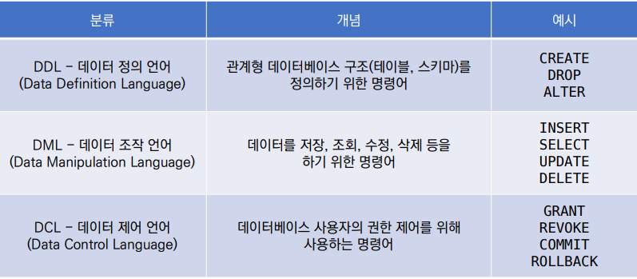

# 📕Database

- 체계화된 데이터의 모임

- 여러 사람이 공유하고 사용할 목적으로 통합 관리되는 정보의 집합
- 데이터베이스로 얻는 장점들
  - 데이터 중복 최소화
  - 데이터 무결성 (정확한 정보를 보장)
  - 데이터 일관성
  - 데이터 독립성 (물리적 / 논리적)
  - 데이터 표준화
  - 데이터 보안 유지

### 1. 관계형 데이터베이스 (RDB, Relational Database)

- 서로 관련된 데이터를 저장하고 접근할 수 있는 데이터베이스 유형
- 키(key)와 값(value)들의 간단한 관계(relation)를 표(table) 형태로 정리한 데이터베이스

1. schema : 자료의 구조, 표현방법, 관계등 전반적인 **명세를 기술**한 것
2. table : 열과 행의 모델을 사용해 조직된 데이터 요소들의 집합
3. 열(column) : 각 열에 고우한 데이터 형식 저장
4. 행(row) : 실제 데이터가 저장되는 형태
5. 기본키(Primary Key) : 각 행의 고유값 
   - 데이터베이스 관리 및 관계 설정 시 주요하게 활용 되므로 필히 설정해야 함

---

### 2. 관계형 데이터베이스 관리 시스템 (RDBMS)

- 관계형 모델을 기반으로 하는 데이터베이스 관리시스템을 의미
  - MySQL , SQLite , PostgreSQL , ORACLE , 등이 있다

- SQLite
  - 서버 형태가 아닌 파일 형식으로 응용 프로그램에 넣어서 사용하는 **비교적 가벼운 데이터베이스**
  - 구글 안드로이드 운영체제에 기본적으로 탑재되었으며 임베디드 소프트웨어에도 많이 활용됨
  - 로컬에서 간단한 DB 구성을 할 수 있으며, 오픈소스 프로젝트이기 때문에 자유롭게 사용가능
- SQLite Data Type
  1. NULL : 없음, 비어있음
  2. INTRGER : 8바이트에 저장된 부호 있는 정수
  3. REAL : 8바이트 부동 소수점 숫자로 저장된 부동 소수점 값
  4. TEXT : 문자로 인식되는 값
  5. BLOB : 별다른 TYPE 없이 그대로 저장된 데이터

---

### 3. SQL (Structured Query Language)

- 관계형 데이터베이스 관리시스쳄의 **데이터 관리**를 위해 설계된 **특수 목적의 프로그래밍 언어**
  - 데이터베이스 스키마 생성 및 수정
  - 자료의 검색 및 관리
  - 데이터베이스 객체 접근 조정 관리

​	

---

### 4. SQL (Hello World!)

1. 데이터베이스 생성

```sql
$ sqlite3 tutorial.sqlite3  -- *.sqlite3 파일 생성 후 실행
sqlite> .database   -- '.'은 sqlite에서 활용되는 명령어
```

2. csv파일을 table로 만들기
   - csv : ','로 구분 되어진 데이터 값

```sql
.mode csv  -- csv모드로 설정
.import hellodb.csv examples  -- examples라는 table에 csv자료를 올린다
.tables  -- table 확인
examples
```

3. 확인(조회)하기

```sql
SELECT * FROM examples;  -- '.'으로 시작하는 명령어가 아닌 경우 입력(쿼리)마지막에 ';'입력
1,길동,홍,600,충청도,010-0000-0000
```

4. 터미널 view변경하기

```sql
.headers ON  -- 각 값들의 명칭(머릿말)도 보이도록
id,first_name,last_name,age,country,phone
1,길동,홍,600,충청도,010-0000-0000

.mode column  -- 보기 좋게 출력
id,first_name,last_name,age,country,phone
-----------------------------------------
1,길동,홍,600,충청도,010-0000-0000
-- 다른 예시
first_name  last_name  age  country  phone          balance
----------  ---------  ---  -------  -------------  -------
정호          유          40   전라북도     016-7280-2855  370
경희          이          36   경상남도     011-9854-5133  5900
```

---

### 5. 테이블 생성 및 삭제

1. 생성

```sql
CREATE TABLE classmates (
    id INTEGER PRIMARY KEY, 
    name TEXT
);

-- 확인
.tables
classmates  examples

-- 특정 테이블의 shcema조회
.schema classmates
-- CREATE TABLE classmates (
-- id INTEGER PRIMARY KEY, 
-- name TEXT
-- );
```

2. 삭제

```sql
DROP TABLE classmates;

-- 확인
.tables
examples
```

3. 필드 제약 조건
   - NOT NULL : NULL 값 입력 금지
   - UNIQUE : 중복 값 입력 금지 (NULL 값은 중복 입력 가능)
   - PRIMARY KEY : 테이블에서 반드시 하나. NOT NULL + UNIQUE
   - FOREIGN KEY : 외래키. 다른 테이블의 Key
   - CHECK : 조건으로 설정된 값만 입력 허용
   - DEFAULT : 기본 설정 값

---

## 📗CRUD

> **C**reate, **R**ead, **U**pdate, **D**elete 

### 1. CREATE

- INSERT 

```sql
CREATE TABLE 테이블_이름 (
    컬럼1 TEXT,
    컬럼2 INT,
    컬럼3 TEXT
);

-- 테이블에 단일 행 삽입
INSERT INTO 테이블_이름 (컬럼1, 컬럼2) VALUES (값1, 값2);

-- 테이블에 정의된 모든 컬럼에 맞춰 순서대로 입력하면 생략 가능
INSERT INTO 테이블_이름 VALUES (값1, 값2, 값3);
```

- rowid 

```sql
SELECT rowid, * FROM classmates;
-- rowid는 SQLite에서 자동으로 제공하고 있는 PK. 값이 1씩 증가하는 모습을 보임.
-- rowid  name  age  address
-- -----  ----  ---  -------
-- 1      홍길동   23
-- 2      홍길동   23   서울
-- 3      김철수   40   서울
```

### 2. READ

- SELECT
  - 테이블에서 데이터를 조회
  - SELECT 문은 SQLite에서 가장 기본이 되는 문이며 다양한 절(clause)와 함께 사용
    - ORDER BY, DISTINCT, WHERE, LIMIT, GROUP BY …
- LIMIT
  - 쿼리에서 반환되는 행 수를 제한
  - 특정 행부터 시작해서 조회하기 위해 OFFSET 키워드와 함께 사용하기도 함
- WHERE
  - 쿼리에서 반환된 행에 대한 특정 검색 조건을 지정
- SELECT DISTINCT
  - 조회 결과에서 중복 행을 제거
  - DISTINCT 절은 SELECT 키워드 바로 뒤에 작성해야 함

```sql
SELECT rowid, name FROM classmates;
-- rowid  name
-- -----  ----
-- 1      홍길동
-- 2      김철수
-- 3      이호영
-- 4      박민희
-- 5      최혜영

SELECT rowid, name FROM classmates LIMIT 2;
-- rowid  name
-- -----  ----
-- 1      홍길동
-- 2      김철수

SELECT rowid, name FROM classmates LIMIT 1 OFFSET 2;
-- rowid  name
-- -----  ----
-- 3      이호영

SELECT * FROM classmates WHERE address='서울';
-- name  age  address
-- ----  ---  -------
-- 홍길동   30   서울

SELECT DISTINCT age FROM classmates;
-- age
-- ---
-- 30
-- 26
-- 29
-- 28
```

### 3. UPDATE

- UPDATE 
  - 데이터를 수정하며 WHERE로 수정 할 행 위치를 SET으로 수정할 컬럼과 값을 지정

```sql
SELECT rowid, * FROM classmates;
-- rowid  name  age  address
-- -----  ----  ---  -------
-- 1      홍길동   30   서울
-- 2      김철수   30   제주
-- 3      이호영   26   인천
-- 4      박민희   29   대구
-- 5      주세환   40   대전

-- 수정
UPDATE classmates SET name='홍길동', address='제주도' WHERE rowid=5;
SELECT rowid, * FROM classmates;
-- rowid  name  age  address
-- -----  ----  ---  -------
-- 1      홍길동   30   서울
-- 2      김철수   30   제주
-- 3      이호영   26   인천
-- 4      박민희   29   대구
-- 5      홍길동   40   제주도
```

### 4. DELETE

- DELETE
  - 데이터를 삭제하며 WHERE로 삭제 할 행을 지정

```sql
-- 삭제 
DELETE FROM classmates WHERE rowid=5;
-- rowid  name  age  address
-- -----  ----  ---  -------
-- 1      홍길동   30   서울
-- 2      김철수   30   제주
-- 3      이호영   26   인천
-- 4      박민희   29   대구
```

